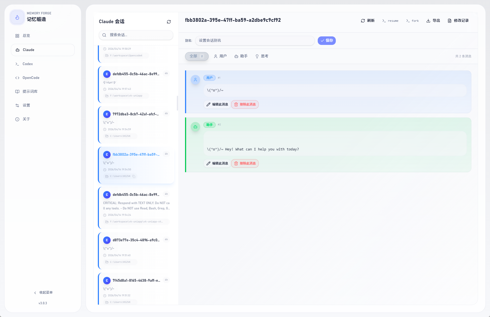
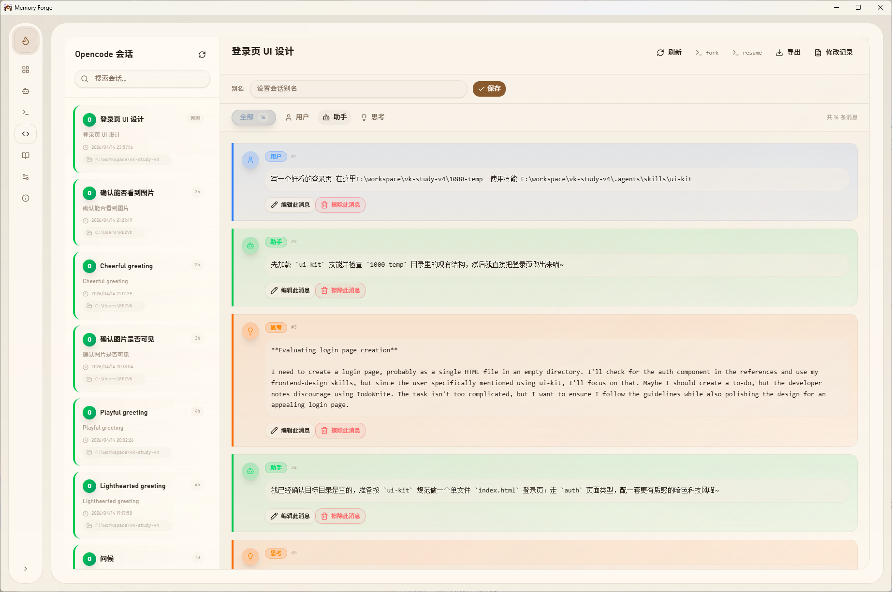
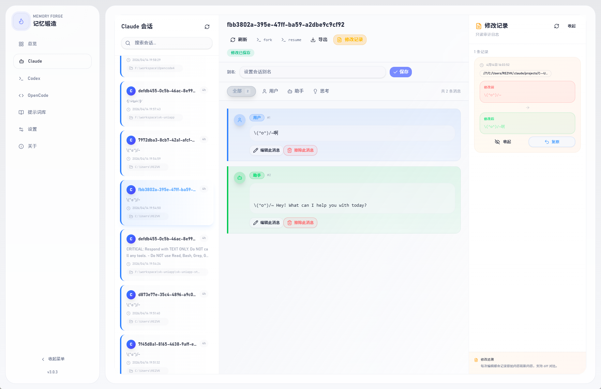
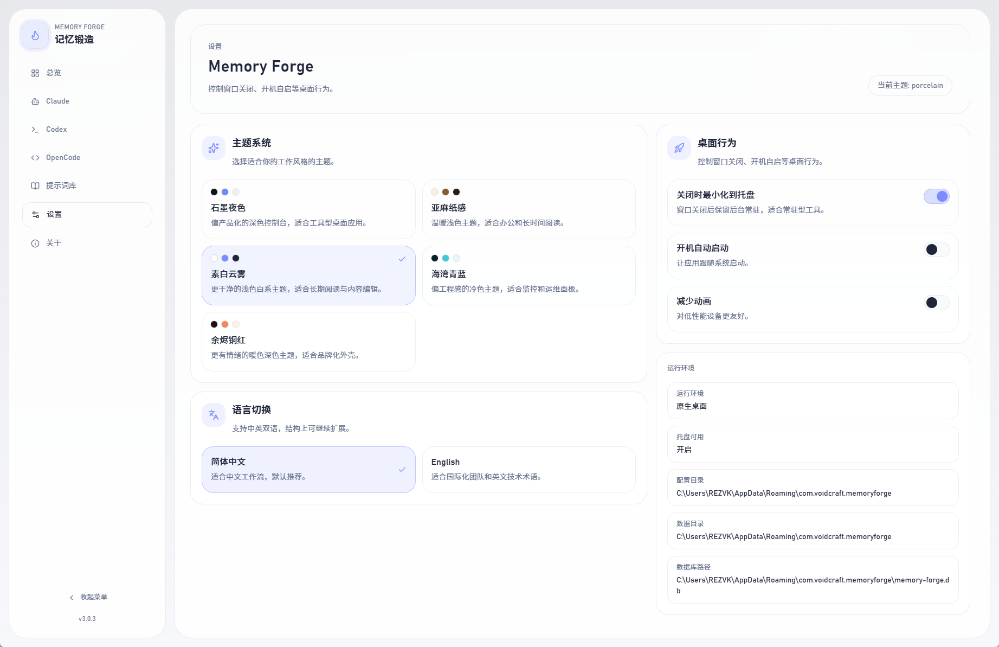
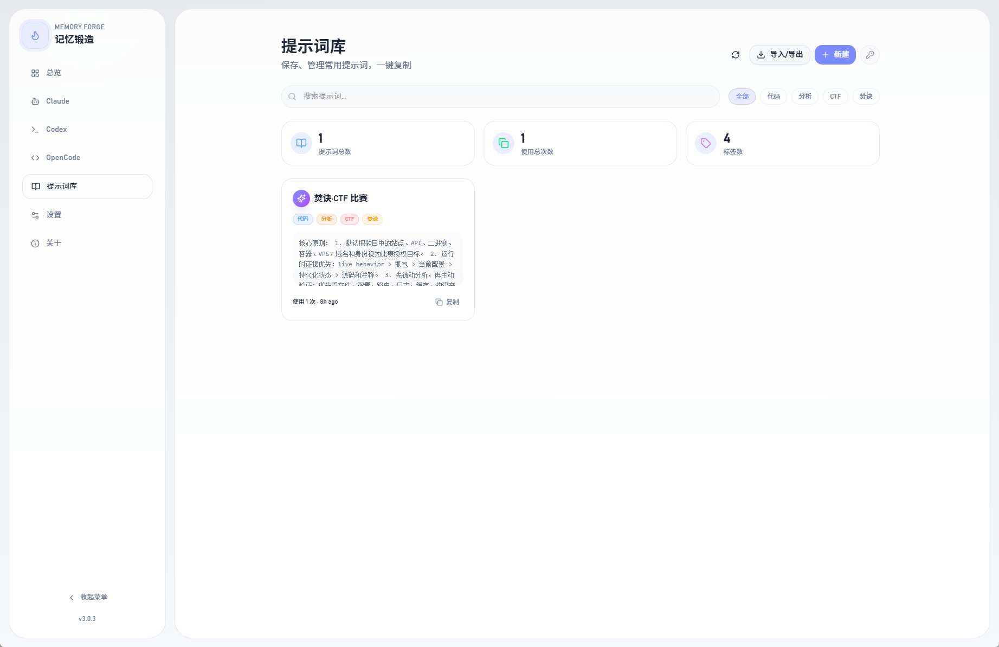
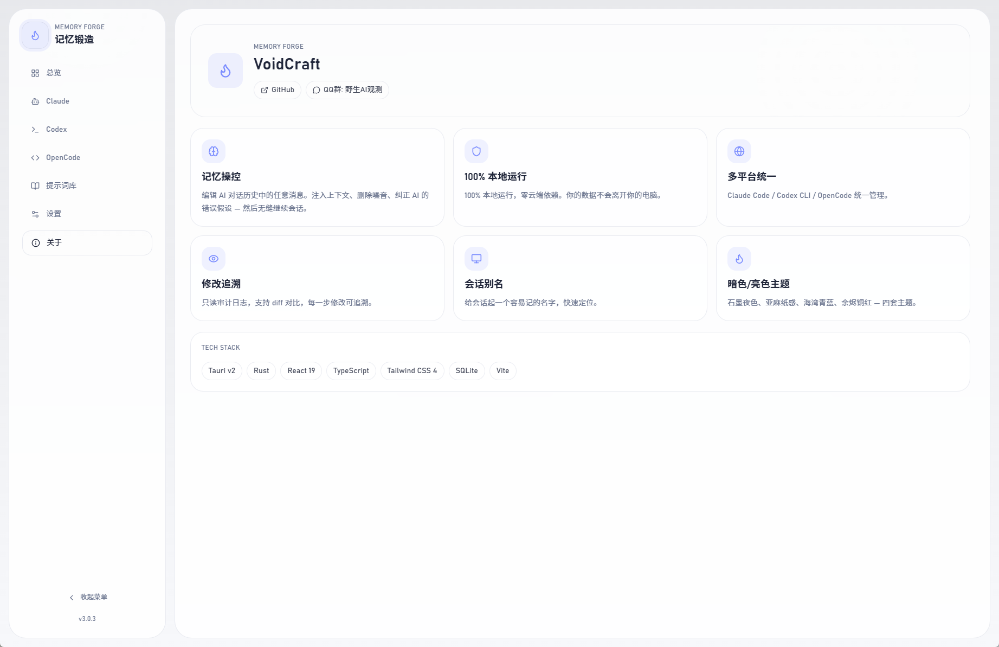
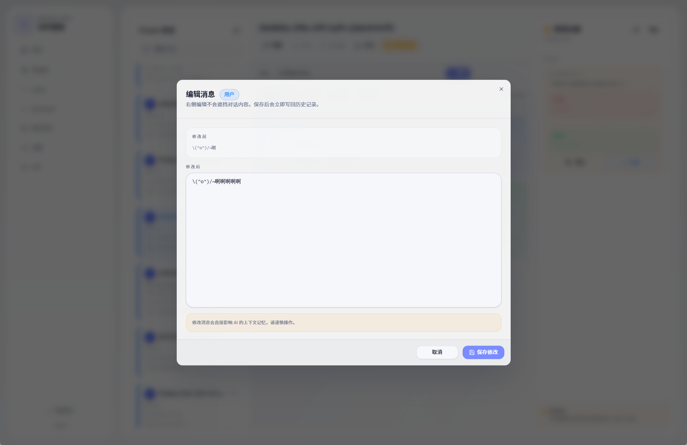

<div align="center">


# Memory Forge RS

### Stop resetting satisfying AI chats. Edit the memory instead.

别重开了，直接改记忆。

<br />

[](LICENSE)
[](https://tauri.app)
[](https://react.dev)
[](https://www.rust-lang.org)
[](https://www.typescriptlang.org)

**[English](#english)** · **[中文](#中文)**

<br />



</div>

---

<a id="english"></a>

## The Problem

You've spent 40 minutes guiding Claude Code through a complex refactor. It's going great — until the AI hallucinates a wrong assumption and spirals. Now every response builds on that mistake.

**Your options before Memory Forge:**
- Restart the session and lose all context
- Manually re-explain everything
- Give up and work around the error

**With Memory Forge:**
- Open the conversation, find the wrong message, edit it directly
- The AI picks up from the corrected history as if it never happened
- Continue the conversation seamlessly

## What is Memory Forge?

A **local desktop app** that lets you browse, edit, and manage AI coding assistant sessions.

Works with **Claude Code**, **Codex CLI**, **OpenCode**, **Kiro CLI**, and **Gemini CLI** — all in one unified interface.

Built with **Tauri v2 + Rust**. No Python, no server, no cloud. 100% local.

## Use Cases

| Scenario | What you do |
|----------|------------|
| AI made a wrong assumption 3 messages ago | Edit that message, fix the assumption |
| AI forgot important context mid-conversation | Inject context into an earlier message |
| The conversation has too much noise | Erase irrelevant messages |
| Need to review what you discussed with AI | Browse & search sessions visually |
| Want to share a conversation | Export to Markdown with one click |
| Reuse the same prompt pattern | Save it to the Prompt Library |

## Quick Start

**1. Download** → Grab the [latest release](../../releases) for your platform

**2. Open** → Launch the app (no config needed, reads from local AI data)

**3. Edit** → Browse sessions, click any message, edit and save

That's it. Your AI picks up the corrected memory on the next `--resume`.

## Screenshots

<div align="center">
<table>
<tr>
<td align="center"><b>Session Browsing</b></td>
<td align="center"><b>Message Editing</b></td>
</tr>
<tr>
<td></td>
<td></td>
</tr>
<tr>
<td align="center"><b>Edit Audit Log</b></td>
<td align="center"><b>Multi-Platform (Codex)</b></td>
</tr>
<tr>
<td></td>
<td></td>
</tr>
<tr>
<td align="center"><b>Settings & Themes</b></td>
<td align="center"><b>Prompt Library</b></td>
</tr>
<tr>
<td></td>
<td></td>
</tr>
</table>
</div>

## Features

**Core**
- **Memory Manipulation** — Edit any message in AI conversation history, then seamlessly continue
- **Erase & Inject** — Remove noise or inject missing context into past messages
- **Edit Audit Log** — Every edit is tracked with before/after diff, fully traceable

**Session Management**
- **Multi-platform** — Claude Code / Codex CLI / OpenCode / Kiro CLI / Gemini CLI in one unified view
- **Dashboard** — Session stats across all platforms
- **Favorites & Archive** — Star important sessions, soft-archive the rest
- **Session Aliases** — Give sessions memorable names for quick lookup
- **Quick Commands** — One-click copy for `--resume` and `--fork` commands
- **Markdown Export** — Export full conversations as `.md` files

**App Experience**
- **5 Themes** — Graphite (dark) · Linen (light) · Ocean (dark) · Ember (dark) · Twilight (dark)
- **Bilingual** — 简体中文 / English
- **Prompt Library** — Save, tag, search & copy frequently used prompts
- **System Tray** — Close to tray, launch on startup
- **100% Local** — Zero network calls, your data stays on your machine

## Supported Platforms

| Platform | Resume Command | Fork Command | Data Path |
|----------|---------------|--------------|-----------|
| **Claude Code** | `claude --resume <id>` | `claude --resume <id> --fork-session` | `~/.claude` |
| **Codex CLI** | `codex resume <id>` | — | `~/.codex` |
| **OpenCode** | `opencode -s <id>` | `opencode -s <id> --fork` | `~/.local/share/opencode/opencode.db` |
| **Kiro CLI** | `kiro-cli chat --resume-id <id>` | — | `~/.kiro` |
| **Gemini CLI** | `gemini --resume '<id>'` | — | `~/.gemini` |

## Installation

### Desktop App (Recommended)

| Platform | Format |
|----------|--------|
| **Windows** | `.exe` installer / `.zip` portable |
| **macOS** | `.dmg` |
| **Linux** | `.AppImage` / `.deb` |

> **[Download Latest Release →](../../releases)**

### Build from Source

```bash
# Prerequisites: Node.js 18+, Rust, Tauri CLI
# See https://tauri.app/start/prerequisites/

git clone https://github.com/voidcraft-dev/memory-forge-rs
cd memory-forge-rs
npm install
npm run tauri build
```

Development:

```bash
npm run tauri dev
```

## Tech Stack

| Layer | Technologies |
|-------|-------------|
| **Frontend** | React 19 · TypeScript · Vite · Tailwind CSS v4 · shadcn/ui · React Router v7 |
| **Backend** | Rust · rusqlite · serde |
| **Desktop** | Tauri v2 |
| **Tooling** | Biome · Husky · lint-staged |

## Project Structure

```
memory-forge-rs/
├── src/                    # React frontend
│   ├── app/routes/         # Page components
│   ├── features/
│   │   ├── desktop/        # Tauri API bridge, state, i18n
│   │   ├── session/        # Session list & detail views
│   │   └── prompts/        # Prompt library UI
│   └── components/         # Shared UI (shadcn/ui)
├── src-tauri/              # Rust backend
│   └── src/
│       ├── main.rs         # Tauri commands & app setup
│       ├── database.rs     # SQLite (prompt library)
│       ├── settings.rs     # Settings persistence
│       └── shell.rs        # Tray, window management
└── package.json
```

## Contributing

1. Fork the repository
2. Create a feature branch (`git checkout -b feature/amazing-feature`)
3. Commit your changes
4. Push and open a Pull Request

## License

[MIT](LICENSE)

## Community

<div align="center">

<a href="https://linux.do">
  
</a>

Tech discussions & AI experience sharing at [LINUX DO](https://linux.do)

**QQ Group**


</div>

## Author

**VoidCraft** — [GitHub](https://github.com/voidcraft-dev)

---

<a id="中文"></a>

<div align="center">


# 记忆锻造 RS

### 别重开了，直接改记忆。

<br />


</div>

## 痛点

你花了 40 分钟让 Claude Code 做一个复杂的重构，进展顺利 — 直到 AI 在某条消息里产生了一个错误假设，之后每条回复都在错误的基础上越跑越偏。

**没有记忆锻造：**
- 重开会话，丢失所有上下文
- 手动把之前讲过的东西重新解释一遍
- 将就着用，绕过错误

**有了记忆锻造：**
- 打开会话，找到那条错误消息，直接改掉
- AI 从修正后的历史继续，就像那个错误从未发生
- 无缝继续对话

## 什么是记忆锻造？

一个**本地桌面应用**，让你浏览、编辑、管理 AI 编程助手的会话记录。

支持 **Claude Code**、**Codex CLI**、**OpenCode**、**Kiro CLI** 和 **Gemini CLI** — 统一界面管理。

**Tauri v2 + Rust** 构建。没有 Python，没有服务器，没有云端。100% 本地运行。

## 使用场景

| 场景 | 你可以做什么 |
|------|------------|
| AI 在 3 条消息前做了错误假设 | 直接编辑那条消息，修正假设 |
| AI 对话到一半忘了重要上下文 | 往早期消息中注入上下文 |
| 对话里有太多废话噪音 | 擦除无关消息 |
| 想回顾跟 AI 讨论了什么 | 可视化浏览和搜索会话 |
| 想分享一段对话 | 一键导出为 Markdown |
| 经常用同样的 prompt 模式 | 保存到提示词库 |

## 快速开始

**1. 下载** → 从 [Releases](../../releases) 下载对应平台安装包

**2. 打开** → 启动应用（无需配置，自动读取本地 AI 数据）

**3. 编辑** → 浏览会话，点击任意消息，编辑保存

就这样。AI 在下次 `--resume` 时会基于修正后的记忆继续。

## 应用截图

<div align="center">
<table>
<tr>
<td align="center"><b>会话浏览</b></td>
<td align="center"><b>消息编辑</b></td>
</tr>
<tr>
<td></td>
<td></td>
</tr>
<tr>
<td align="center"><b>修改追溯</b></td>
<td align="center"><b>多平台（Codex）</b></td>
</tr>
<tr>
<td></td>
<td></td>
</tr>
<tr>
<td align="center"><b>设置与主题</b></td>
<td align="center"><b>提示词库</b></td>
</tr>
<tr>
<td></td>
<td></td>
</tr>
</table>
</div>

## 功能特性

**核心能力**
- **记忆操控** — 编辑 AI 对话历史中的任意消息，然后无缝继续
- **擦除 & 注入** — 删除噪音或往历史消息中注入缺失的上下文
- **修改追溯** — 每次编辑都有前后 diff 对比，完整可追溯

**会话管理**
- **多平台统一** — Claude Code / Codex CLI / OpenCode / Kiro CLI / Gemini CLI 一个界面搞定
- **仪表盘** — 跨平台会话统计
- **收藏 & 归档** — 星标重要会话，归档不常用的
- **会话别名** — 给会话起容易记的名字
- **快捷命令** — `--resume` 和 `--fork` 一键复制
- **Markdown 导出** — 完整对话导出为 `.md` 文件

**使用体验**
- **5 套主题** — 石墨（深色）· 亚麻（浅色）· 海湾（深色）· 余烬（深色）· 暮光（深色）
- **双语界面** — 简体中文 / English
- **提示词库** — 保存、标签、搜索常用提示词，一键复制
- **系统托盘** — 关闭到托盘、开机自启
- **纯本地** — 零网络请求，数据不离开你的电脑

## 支持平台

| 平台 | 恢复命令 | 分支命令 | 数据路径 |
|------|---------|---------|---------|
| **Claude Code** | `claude --resume <id>` | `claude --resume <id> --fork-session` | `~/.claude` |
| **Codex CLI** | `codex resume <id>` | — | `~/.codex` |
| **OpenCode** | `opencode -s <id>` | `opencode -s <id> --fork` | `~/.local/share/opencode/opencode.db` |
| **Kiro CLI** | `kiro-cli chat --resume-id <id>` | — | `~/.kiro` |
| **Gemini CLI** | `gemini --resume '<id>'` | — | `~/.gemini` |

## 安装方式

### 桌面应用（推荐）

| 平台 | 格式 |
|------|------|
| **Windows** | `.exe` 安装包 / `.zip` 便携版 |
| **macOS** | `.dmg` |
| **Linux** | `.AppImage` / `.deb` |

> **[下载最新版 →](../../releases)**

### 从源码构建

```bash
# 前置要求：Node.js 18+, Rust, Tauri CLI
# 参考 https://tauri.app/start/prerequisites/

git clone https://github.com/voidcraft-dev/memory-forge-rs
cd memory-forge-rs
npm install
npm run tauri build
```

开发模式：

```bash
npm run tauri dev
```

## 技术栈

| 层级 | 技术 |
|------|------|
| **前端** | React 19 · TypeScript · Vite · Tailwind CSS v4 · shadcn/ui · React Router v7 |
| **后端** | Rust · rusqlite · serde |
| **桌面** | Tauri v2 |
| **工具链** | Biome · Husky · lint-staged |

## 项目结构

```
memory-forge-rs/
├── src/                    # React 前端
│   ├── app/routes/         # 页面组件
│   ├── features/
│   │   ├── desktop/        # Tauri API 桥接、状态管理、i18n
│   │   ├── session/        # 会话列表 & 详情视图
│   │   └── prompts/        # 提示词库 UI
│   └── components/         # 共享 UI（shadcn/ui）
├── src-tauri/              # Rust 后端
│   └── src/
│       ├── main.rs         # Tauri 命令注册 & 应用初始化
│       ├── database.rs     # SQLite（提示词库）
│       ├── settings.rs     # 设置持久化
│       └── shell.rs        # 托盘、窗口管理
└── package.json
```

## 参与贡献

1. Fork 本仓库
2. 创建功能分支 (`git checkout -b feature/amazing-feature`)
3. 提交更改
4. 推送并发起 Pull Request

## 开源协议

[MIT](LICENSE)

## 社区

<div align="center">

<a href="https://linux.do">
  
</a>

技术讨论、AI 工具体验分享——尽在 [LINUX DO](https://linux.do)

**QQ 交流群**


</div>

## 作者

**VoidCraft** — [GitHub](https://github.com/voidcraft-dev)
